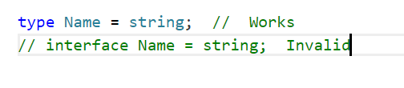
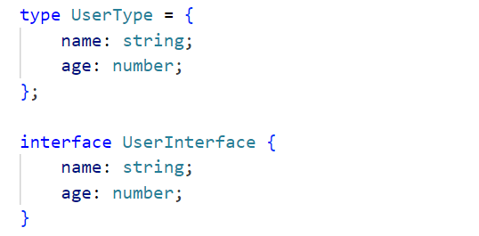
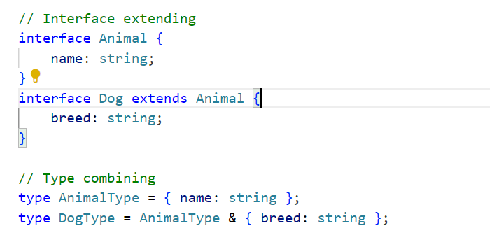
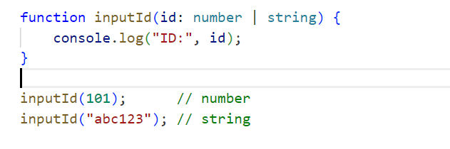

# TypeScript: Type vs Interface – What’s the Difference?

TypeScript is a tool that builds on top of JavaScript and adds types to your code. This helps catch mistakes early and makes your code easier to understand. In TypeScript, you can describe the shape of data using types or interfaces. They seem very similar, so it can be confusing to know which one to use. In this post, we’ll explain the main differences between type and interface in a simple way, and show you when to use each.

# TypeScript types

In TypeScript, type is used to define the kind of data a variable can hold. This includes basic types like string, number, and boolean, as well as custom ones.

A type alias lets you give a name to a type without creating a new one. You also need to use type when working with union types (like string | number).

Tuples in TypeScript let you create an array with a fixed number of items, where each item can have a different type. You can only define tuples using the type keyword.

TypeScript interfaces

In TypeScript, an interface is used to define the structure of an object. It tells what properties an object should have and what types those properties should be.

Interfaces are mainly used for working with objects and classes. They are also easy to extend, so you can add more properties later or combine multiple interfaces.

# Key Differences Between Types and Interfaces

One big difference is that type can be used with primitive values like string, number, or boolean, but interface cannot.

Both type and interface can define the shape of an object, meaning they describe what properties an object should have and their types.

Both type and interface can be extended to build on existing structures:
interface uses extends
type uses & (intersection)

# When to Use What?

Use interface when defining object shapes, especially for class-based designs.
Use type when working with unions, intersections, tuples, or primitives.

# Conclusion

Both type and interface are powerful tools in TypeScript. The choice depends on your use case. Understanding their differences helps you write more readable, maintainable, and scalable code.

# Understanding Union and Intersection Types in TypeScript

TypeScript gives developers powerful tools to describe complex data structures. Two of the most useful features are union and intersection types. These allow us to combine types in different ways to write safer and more flexible code.

# Union Types (|):

The type of a variable or expression can consist of multiple types. This is called a union type. 
It allows you to store a value of one of several types in a variable.

Here, id can be a number or a string.
Union types are helpful when you want a variable to support different types of input (like numbers or strings).

# Intersection Types (&):

An intersection type creates a new type by combining multiple existing types. The new type has all features of the existing types.
Intersection types are useful when you want to merge multiple types to create a more detailed structure. 
To combine types, you use the & operator.

Here, AdminUser must have both name (from User) and role (from Admin).

# Conclusion

Union and intersection types in TypeScript help make our code more flexible and safer. Use unions when a value can be multiple types, and use intersections when a value must meet multiple type conditions.

